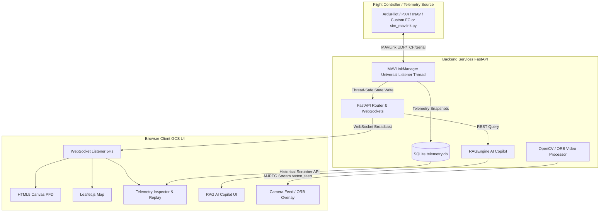
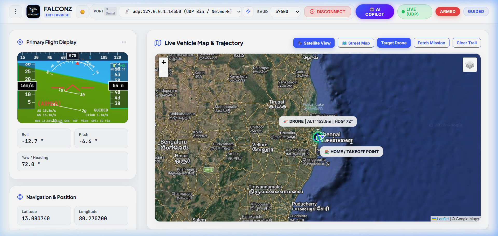
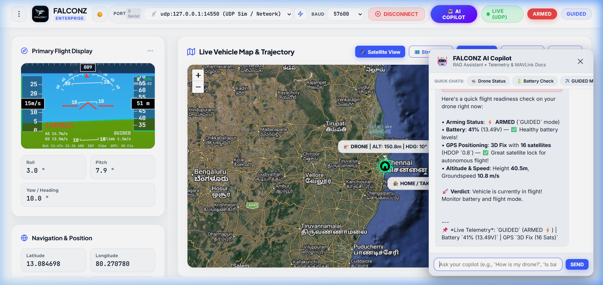

# 🛸 FalconZ — Next-Gen Universal Web-Based Ground Control Station & AI Aerospace Copilot

[](https://opensource.org/licenses/MIT)
[](https://www.python.org/)
[](https://fastapi.tiangolo.com/)
[](https://mavlink.io/en/)
[](https://mavlink.io/en/)
[](https://developer.mozilla.org/en-US/docs/Web/API/WebSocket)
[](https://www.sqlite.org/)
[](https://opencv.org/)

### 🎬 Live Demo Animation


> [!NOTE]
> **THE UNIVERSAL FLIGHT CONTROLLER VISION**
> 
> **Every traditional flight controller requires its own specific, vendor-locked software system to calibrate and monitor telemetry** (e.g. Mission Planner for ArduPilot/APM, QGroundControl for PX4, INAV Configurator for INAV, Betaflight Configurator for FPV). 
> 
> **FalconZ breaks this fragmentation.** It provides a **single, universal, web-native platform** capable of interfacing with, calibrating, monitoring, and diagnosing **ALL types of flight controllers** (ArduPilot/APM, PX4, INAV, Betaflight with MAVLink bridge, LibrePilot, and custom embedded robotics stacks) and **ALL telemetry connection modes** (UDP, TCP, Serial COM ports, 915MHz/433MHz radios, and SITL simulators) in one unified system.

---

## 🌐 Universal Flight Controller & Calibration Platform

> [!IMPORTANT]
> **One Universal Interface for Any Flight Controller.** Instead of switching between multiple vendor-specific GCS tools, FalconZ establishes a normalized MAVLink v1/v2 telemetry and calibration pipeline that supports any UAV platform, frame type, or autopilot hardware.

| Platform / Autopilot | Compatibility Status | Calibration & Telemetry Capabilities |
| :--- | :--- | :--- |
| **ArduPilot (APM)** | Full Native Support | 6-Axis Accel, 3D Compass Sphere, RC Channels, Live PFD & Map |
| **PX4 Autopilot** | Full Native Support | Multicopter/VTOL Telemetry, Offboard/Hold Modes, Sensor Calibration |
| **INAV / Betaflight** | Supported via MAVLink Bridge | Real-Time Telemetry, RC PWM Gauges, GPS Tracking, Battery Alarm |
| **Custom Embedded FCs** | Supported via MAVLink / Serial | Custom Robotics, AGVs, Experimental UAVs, Serial Data Stream |
| **SITL / Simulators** | Full Native Support | ArduPilot SITL, PX4 Gazebo, AirSim, X-Plane, Custom Simulators |

---

## 📋 Table of Contents

1. [Project Overview](#1-project-overview)
2. [Problem Statement](#2-problem-statement)
3. [Proposed Solution](#3-proposed-solution)
4. [Why I Built This](#4-why-i-built-this)
5. [Engineering Challenges](#5-engineering-challenges)
6. [Development Journey](#6-development-journey)
7. [System Architecture](#7-system-architecture)
8. [Features](#8-features)
9. [Technologies Used](#9-technologies-used)
10. [Repository Structure](#10-repository-structure)
11. [Installation Guide](#11-installation-guide)
12. [Usage Guide](#12-usage-guide)
13. [Screenshots Section](#13-screenshots-section)
14. [Future Roadmap](#14-future-roadmap)
15. [Known Limitations](#15-known-limitations)
16. [Lessons Learned](#16-lessons-learned)
17. [Future Improvements](#17-future-improvements)
18. [For Recruiters and Reviewers](#for-recruiters-and-reviewers)

---

## 1. Project Overview

### What is FalconZ?
**FalconZ** is a full-stack, web-native Ground Control Station (GCS) and real-time UAV diagnostic platform. It establishes a multi-threaded telemetry and calibration bridge between unmanned aircraft (or flight simulators) and a modern browser interface. FalconZ combines real-time flight instrument rendering (Artificial Horizon/PFD), interactive map navigation, SQLite-backed telemetry historical replay, OpenCV camera vision with ORB feature detection, step-by-step universal sensor calibration, and a self-contained AI Copilot that fuses live flight telemetry with indexed aerospace manuals to deliver context-aware diagnostics and pre-arm safety guidance.

### Why Was It Created?
Historically, drone developers and pilots have been forced to install and maintain **separate software environments for each specific flight controller type**:
* **Mission Planner / APM Planner**: Only for ArduPilot/APM flight controllers.
* **QGroundControl**: Primary choice for PX4.
* **INAV Configurator / Betaflight Configurator**: Required for INAV or Betaflight FPV boards.

This software fragmentation creates immense setup friction, vendor lock-in, and steep learning curves. FalconZ was created to demonstrate that **a single, browser-native GCS can unify all types of flight controllers under one intuitive interface**, offering universal telemetry monitoring, standardized calibration routines, zero-install access, modern visual design, and real-time AI reasoning.

### Who is the Target Audience?
* **Drone Engineers & Software Developers**: Who need a universal, extensible web interface to configure, calibrate, test, and visualize telemetry across multiple flight controller architectures without swapping GCS applications.
* **UAV Operators & Test Pilots**: Who require a clean, responsive, dark-mode ground station capable of running on tablets, field laptops, or companion computers without installation overhead.
* **Aerospace Researchers & Autonomous Systems Students**: Who seek a modular codebase to experiment with multi-protocol telemetry handling, time-series telemetry logging, computer vision tracking, and RAG-based automated flight assistants.

---

## 2. Problem Statement

### What Problems Exist in Current Drone Software?
1. **Software Fragmentation & Vendor Lock-In**: Every flight controller type traditionally requires its own dedicated software tool to calibrate sensors and configure flight parameters. Operators managing a fleet of different drones must learn, install, and update 3–4 separate GCS software packages.
2. **Heavy Native Dependencies & Installation Friction**: Desktop GCS tools require platform-specific installers, GPU driver configurations, and bulky runtime environments. Remote monitoring on field tablets or web browsers requires complex video capture or streaming hacks.
3. **Cluttered & Outdated User Interfaces**: Legacy GCS software often presents overwhelming interfaces packed with hundreds of unorganized parameters, making key metrics (like HDOP, battery cell voltage, and arming inhibitors) difficult to spot during high-stress flight operations.
4. **Black-Box Diagnostic Failures**: When a drone refuses to arm or experiences a pre-arm check failure (e.g., `COMPASS_OFS_X` out of bounds, high HDOP, or EKF check failure), operators must manually search dense technical documentation or forums while in the field.
5. **Lack of Native Real-Time AI Assistance**: Traditional software displays raw numeric telemetry without semantic context. They cannot answer questions like *"Why is GUIDED mode failing right now based on my current GPS HDOP and satellite count?"*

### Pain Points Faced by Developers & Pilots
* **Multi-Vehicle Software Switching**: Swapping between an ArduPilot quadcopter, a PX4 VTOL, and an INAV FPV wing requires switching between Mission Planner, QGroundControl, and INAV Configurator—each with entirely different shortcuts, calibration workflows, and menu structures.
* **Field Setup Latency**: Setting up ground control software on a new field laptop takes 15–30 minutes of installing software, configuring drivers, and setting up serial ports.
* **Telemetry Replay Frustration**: Replaying binary `.tlog` or `.bin` files usually requires launching separate offline analysis tools, preventing quick side-by-side comparison of past flight anomalies against live telemetry.

---

## 3. Proposed Solution

### How FalconZ Solves These Problems
FalconZ decouples the telemetry receiver from the client interface using a universal Python backend (FastAPI + PyMAVLink) and lightweight WebSocket streaming:
* **Single Universal Platform for All Flight Controllers**: Replaces fragmented vendor software with a unified web GCS that calibrates, streams, and diagnoses ArduPilot, PX4, INAV, Betaflight (via MAVLink bridge), and custom embedded flight controllers.
* **Universal Calibration Assistant**: Standardized, step-by-step visual UI guides for 6-axis accelerometer leveling, 3D compass sphere rotation, and radio RC channel setup regardless of the underlying autopilot board.
* **Zero-Install Web Access**: Serves an aerospace-grade Web GCS accessible over standard HTTP/WebSocket ports on any desktop, tablet, or mobile browser.
* **Dynamic Primary Flight Display (PFD)**: Renders a smooth 60 FPS artificial horizon, pitch ladder, roll arc, airspeed/altitude ladders, and heading tapes directly onto HTML5 Canvas elements.
* **Telemetry-Augmented AI Copilot (RAG Engine)**: A self-contained semantic retrieval engine that cross-references user queries with indexed technical documentation and active MAVLink telemetry snapshots to explain warnings, suggest corrective actions, and guide calibration routines.
* **Interactive Time-Series Log Replay**: Automatically logs incoming telemetry to an indexed SQLite database (`telemetry.db`), enabling smooth visual scrubbing and historical playback directly inside the map and PFD views.
* **Integrated Computer Vision & Feature Detection**: Includes a real-time OpenCV camera pipeline with dynamic ORB (Oriented FAST and Rotated BRIEF) feature point detection overlaid on video streams.

```
+-----------------------------------------------------------------------------------+
|                            FALCONZ UNIVERSAL PLATFORM                             |
+-----------------------------------------------------------------------------------+
|  [ Flight Controller / Telemetry Stream ]                                         |
|    - ArduPilot / PX4 / INAV / Custom FCs                                          |
|    - UDP (14550), TCP, Serial COM Ports, 915MHz/433MHz Radios                     |
+-----------------------------------------------------------------------------------+
                                         |
                                         v
+-----------------------------------------------------------------------------------+
|  [ FastAPI Backend & Multi-Threaded Engine ]                                      |
|    - MAVLink Universal Listener (v1/v2)  - RAG Aerospace Engine                   |
|    - SQLite Time-Series Database Logger   - OpenCV Video & Feature Processor       |
+-----------------------------------------------------------------------------------+
                                         |
                                         v
+-----------------------------------------------------------------------------------+
|                            BROWSER CLIENT (UNIVERSAL GCS)                         |
|  +--------------------+  +---------------------+  +----------------------------+  |
|  | HTML5 Canvas PFD   |  | Leaflet GPS Map     |  | AI Copilot (RAG)           |  |
|  | Artificial Horizon |  | Vehicle Trajectory  |  | Universal Safety Alerts    |  |
|  +--------------------+  +---------------------+  +----------------------------+  |
|  +--------------------+  +---------------------+  +----------------------------+  |
|  | Telemetry Inspector|  | Camera / ORB Stream |  | Calibration Assistant      |  |
|  | Timeline Replay    |  | Feature Overlay     |  | Step-by-Step Guidance      |  |
|  +--------------------+  +---------------------+  +----------------------------+  |
+-----------------------------------------------------------------------------------+
```

---

## 4. Why I Built This

### Inspiration
As autonomous drone applications expand into delivery, inspection, agriculture, and defense, ground stations must evolve from static telemetry monitors into **universal, intelligent flight assistants**. I observed field operators struggle to diagnose pre-arm check errors across different flight controller platforms while managing cumbersome desktop setups. I wanted to build a web-native GCS that works universally with any flight controller, feels as responsive as a desktop application, and empowers operators with instant AI-driven diagnostic insights.

---

## 5. Engineering Challenges

### 1. Universal Protocol Normalization Across Multiple Flight Controllers
* **Challenge**: Different flight controllers (ArduPilot vs. PX4 vs. INAV) send slightly different MAVLink message subsets, custom flight mode enums, and state flags.
* **Solution**: Designed an abstraction layer in `mavlink_manager.py` that normalizes custom mode numbers (e.g. ArduPilot `GUIDED` vs PX4 `Hold/Mission`) and mapping structures into a standardized unified state schema for the frontend.

### 2. Multi-Threaded MAVLink Handling vs. Asynchronous FastAPI Event Loop
* **Challenge**: `pymavlink` blocking I/O calls (`recv_match`) freeze FastAPI's `asyncio` event loop if run directly on the main thread.
* **Design Decision**: Implemented a dedicated background daemon thread (`MAVLinkManager`) that continuously reads serial/UDP binary streams, updates a thread-safe telemetry state dictionary protected by a `threading.Lock()`, and pushes updates to an async WebSocket broadcaster.

### 3. High-Frequency Canvas Rendering Performance
* **Challenge**: Redrawing full Artificial Horizon displays, pitch scales, roll indicators, and text labels at 60 FPS can suffer from micro-stutter if DOM manipulation is mixed with Canvas context ops.
* **Solution**: Separated HTML layout from Canvas drawing routines in `attitude_indicator.js`. Used `requestAnimationFrame` loops and transformed coordinate spaces (`ctx.save()`, `ctx.translate()`, `ctx.rotate()`, `ctx.restore()`) for clean hardware-accelerated rendering.

### 4. Lightweight AI Reasoning Without Heavy Cloud Dependencies
* **Challenge**: Integrating a cloud LLM for field diagnostics introduces API latency, bandwidth cost, and internet dependency—unacceptable for offline field drone operations.
* **Solution**: Developed a zero-dependency, self-contained RAG Engine (`rag_engine.py`) using keyword tokenization, TF-IDF relevance scoring, and document rank fusion. The engine fuses live telemetry snapshots (battery, GPS, HDOP, flight mode) directly into retrieved documentation prompts locally in milliseconds.

---

## 6. Development Journey

### Phase 1: Universal Protocol Abstraction
Defined the core data model for vehicle telemetry state (`position`, `attitude`, `battery`, `gps`, `vfr_hud`, `heartbeat`, `rc_channels`) capable of ingesting data from ArduPilot, PX4, and custom MAVLink sources.

### Phase 2: Canvas PFD & UI Design System
Built the dark-mode aerospace styling using vanilla CSS custom properties (variables) in `styles.css`. Implemented `attitude_indicator.js` using raw HTML5 2D Canvas methods to draw pitch ladders, roll arcs, and artificial horizon sky/ground gradients. Integrated Leaflet.js map tracking with custom rotated aircraft SVG markers.

### Phase 3: Universal Backend & WebSocket Bridge
Constructed `mavlink_manager.py` with multi-threaded packet decoding, watchdog auto-reconnection, and support for UDP, TCP, and Serial COM ports. Built `main.py` using FastAPI with lifespan connection management and non-blocking WebSocket broadcasting.

### Phase 4: AI Copilot, Time-Series Replay & Computer Vision
Integrated `rag_engine.py` to index flight manuals, failsafe modes, and calibration steps. Added `database.py` for SQLite telemetry persistence and built the time scrubber timeline controller in `telemetry_inspector.js`. Implemented `video_feed` with OpenCV synthetic frame generation and dynamic ORB feature extraction in `orb.js`.

---

## 7. System Architecture

### Component Architecture Diagram



---

## 8. Features

### Core MVP Features
* 🛸 **Universal Real-Time Telemetry Streaming**: Low-latency WebSocket telemetry updates (~5 Hz broadcast rate, ~50 Hz internal decode) compatible with all MAVLink v1/v2 flight controllers.
* ✈️ **Primary Flight Display (PFD)**: 60 FPS HTML5 Canvas Artificial Horizon with dynamic roll arc, pitch ladder (-90° to +90°), heading indicator, airspeed ladder, altitude ladder, and climb rate readout.
* 🗺️ **Live Leaflet.js GPS Tracking**: Interactive satellite/dark map tracking with auto-centered vehicle marker, dynamic heading rotation, flight trail polyline, and distance metrics.
* 🔋 **Comprehensive Telemetry Cards**: Real-time display of:
  * **Flight Mode & Arming**: Mode string (GUIDED, STABILIZE, RTL, AUTO, POSHOLD, OFFBOARD, etc.) and armed status pill badge.
  * **Position & Navigation**: Latitude, Longitude, MSL Altitude, Relative Altitude, Heading.
  * **Speed & VFR HUD**: Groundspeed, Airspeed, Climb Rate, Throttle bar percentage.
  * **Power & Battery**: Voltage, Current, Remaining Battery %, cell warnings.
  * **GPS Quality**: Fix type string (3D Fix, RTK Float, RTK Fixed), Satellite count, HDOP value.
  * **RC Channels**: Live 8-channel PWM pulse width gauges.
* 🤖 **RAG AI Copilot**: Universal context-aware assistant querying technical knowledge bases while evaluating current telemetry metrics (e.g. low battery alarms, poor HDOP warnings).
* 📜 **Telemetry Log Replay & Time Scrubber**: SQLite database recording with interactive timeline slider, playback controls (Play, Pause, Step, 1x–5x Speed multipliers), and spatial replay on map and PFD.
* 📷 **Computer Vision & ORB Feature Detection**: Real-time video streaming with OpenCV camera/synthetic video feed and dynamic ORB corner detection visual overlays.

---

## 9. Technologies Used

### Technology Stack Table

| Layer | Technology | Version | Reason for Choice |
| :--- | :--- | :--- | :--- |
| **Language** | Python | 3.9+ | High readability, rich aerospace/MAVLink libraries (`pymavlink`), fast prototyping. |
| **Backend Framework** | FastAPI | 0.100+ | Asynchronous event loop, native WebSocket support, lightweight JSON REST serialization. |
| **Telemetry Protocol** | MAVLink (PyMAVLink) | 2.4+ | Universal open protocol standard for ArduPilot, PX4, INAV, and custom UAV flight stacks. |
| **Database** | SQLite3 | Native | Zero-configuration time-series telemetry storage, cross-platform portability. |
| **Computer Vision** | OpenCV (`cv2`) | 4.8+ | Industry-standard vision library for video frame processing and ORB feature extraction. |
| **Web Server** | Uvicorn | 0.22+ | Lightning-fast ASGI server implementation for handling concurrent REST & WebSockets. |
| **Frontend Core** | HTML5 / CSS3 / ES6 JS | Native | Zero client-side dependencies, fast execution, maximum cross-browser compatibility. |
| **Rendering Engine** | HTML5 2D Canvas | Native | Hardware-accelerated 60 FPS flight instrument rendering without heavy WebGL overhead. |
| **Mapping Library** | Leaflet.js | 1.9.4 | Extremely fast, open-source interactive mapping library supporting custom SVG rotation markers. |

---

## 10. Repository Structure

```
DRONR/
├── main.py                 # FastAPI application entrypoint, REST API endpoints, WebSocket server
├── mavlink_manager.py      # Multi-threaded MAVLink listener, packet parser, watchdog, state lock
├── rag_engine.py           # RAG engine, TF-IDF scoring, telemetry-augmented AI reasoning
├── database.py             # SQLite database connector, telemetry schema, time-series logger
├── sim_mavlink.py          # Standalone MAVLink telemetry simulator (UDP broadcast to 14550)
├── requirements.txt        # Python package dependencies manifest
├── telemetry.db            # SQLite database file storing historical flight logs
├── LICENSE                 # MIT License file
├── README.md               # Complete project documentation and developer guide
├── static/                 # Static web assets directory
│   ├── index.html          # Single-page Ground Control Station UI layout
│   ├── css/
│   │   └── styles.css      # Aerospace Dark Theme CSS design system
│   ├── js/
│   │   ├── app.js          # Core JS controller, WebSocket manager, API handler
│   │   ├── attitude_indicator.js # HTML5 Canvas Artificial Horizon & PFD drawer
│   │   ├── map.js          # Leaflet.js map tracking & path visualization
│   │   ├── telemetry_inspector.js# Historical telemetry scrubber & replay playback
│   │   ├── rag_copilot.js  # RAG AI Copilot sidebar interaction logic
│   │   └── orb.js          # Video feed & ORB computer vision controls
│   └── images/             # UI logos, icons, and vehicle markers
```

---

## 11. Installation Guide

### Prerequisites
* **Python**: Python 3.9 or higher installed.
* **Git**: Installed on your operating system.

### Step-by-Step Installation

1. **Clone the Repository**:
   ```bash
   git clone https://github.com/sarveshwaran777/FALCONZ.git
   cd FALCONZ
   ```

2. **Create a Virtual Environment (Recommended)**:
   ```bash
   # On Windows
   python -m venv venv
   venv\Scripts\activate

   # On Linux / macOS
   python3 -m venv venv
   source venv/bin/activate
   ```

3. **Install Dependencies**:
   ```bash
   pip install -r requirements.txt
   ```

---

## 12. Usage Guide

### Mode 1: Built-In Telemetry Simulator (Testing & Verification)

1. **Start the FalconZ GCS Server**:
   ```bash
   python main.py
   ```

2. **In a second terminal, start the Telemetry Simulator**:
   ```bash
   python sim_mavlink.py
   ```

3. Open your browser and navigate to: **`http://localhost:8000`**

---

### Mode 2: ArduPilot / PX4 SITL Simulators

1. Launch your SITL simulator (e.g. ArduPilot `sim_vehicle.py` or PX4 Gazebo).
2. Start FalconZ listening on UDP port `14550`:
   ```bash
   python main.py --connection udp:127.0.0.1:14550
   ```
3. Open **`http://localhost:8000`**.

---

### Mode 3: Hardware Flight Controllers (ArduPilot, PX4, INAV, Custom)

Connect your flight controller via USB or Telemetry Radio (915MHz / 433MHz):

* **Windows (COM Port)**:
  ```bash
  python main.py --connection COM5 --baud 57600
  ```
* **Linux / macOS**:
  ```bash
  python main.py --connection /dev/ttyUSB0 --baud 57600
  ```

---

## 13. Screenshots & Live Demo Section

### 🎬 Interactive Web GCS Demo Animation


### 🛸 Live Primary Flight Display & Leaflet GPS Map Dashboard


### 🤖 Telemetry-Augmented AI Copilot Chat Drawer


---

## 14. Future Roadmap

- [ ] **3D Globe Visualization**: Integrate CesiumJS for 3D terrain flight visualization.
- [ ] **Multi-Vehicle Swarm Operations**: Simultaneous tracking and command of multiple drones over unified WebSockets.
- [ ] **Native Autonomous Mission Planning**: Visual waypoint editor with altitude profiles and polygon geofencing.
- [ ] **Cloud Sync & Telemetry Analytics**: Optional cloud backup of `telemetry.db` logs for fleet management.

---

## 15. Known Limitations

* **Single Vehicle Target**: Optimized for single-vehicle tracking per session in current MVP.
* **Browser Video Bandwidth**: Streaming MJPEG frames over standard HTTP endpoints can use higher bandwidth compared to WebRTC for long-distance video feeds.

---

## 16. Lessons Learned

1. **Protocol Normalization is Critical**: Standardizing incoming telemetry into a single unified JSON schema shields the web frontend from individual flight controller quirks.
2. **Thread Isolation Prevents Latency**: Isolating MAVLink I/O into a dedicated thread with explicit locks prevented blocking FastAPI's ASGI event loop.
3. **HTML5 Canvas Performance**: Hardware-accelerated 2D Canvas rendering delivers desktop-class 60 FPS performance without WebGL complexity.

---

## 👨‍💻 For Recruiters and Reviewers

### What This Project Demonstrates
FalconZ demonstrates my ability to design, build, and deploy an **end-to-end, multi-threaded, universal aerospace software system** that bridges diverse hardware flight controllers with modern web applications and artificial intelligence engines.

### Key Software Engineering Skills Showcased
* **Universal Systems Architecture**: Supporting multiple flight controller platforms (ArduPilot, PX4, INAV, Custom FCs) via protocol abstraction.
* **Concurrent Programming & Thread Safety**: Designing daemon threads with `threading.Lock()` mutex synchronization to avoid race conditions and blocking event loops.
* **High-Performance UI Graphics**: Building 60 FPS HTML5 2D Canvas flight displays with dynamic coordinate math and transformation matrices.
* **Artificial Intelligence & Information Retrieval**: Implementing a self-contained RAG (Retrieval-Augmented Generation) engine with TF-IDF keyword scoring, prompt fusion, and context-aware reasoning.
* **Data Engineering & Time-Series Storage**: Structuring indexed SQLite databases for high-frequency telemetry logging, historical scrubbing, and playback.

---

<p align="center">
  <b>FalconZ GCS</b> • Built with Python, FastAPI & MAVLink
</p>
